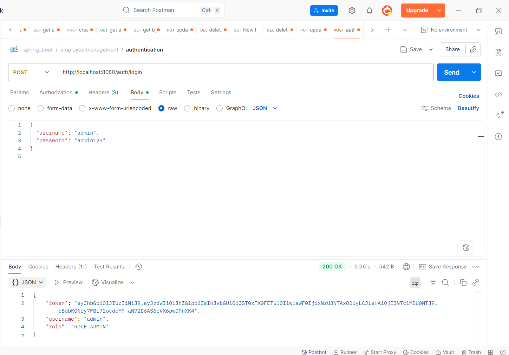
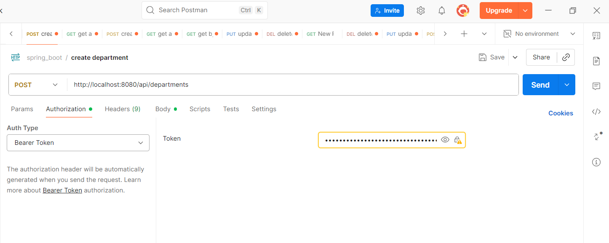
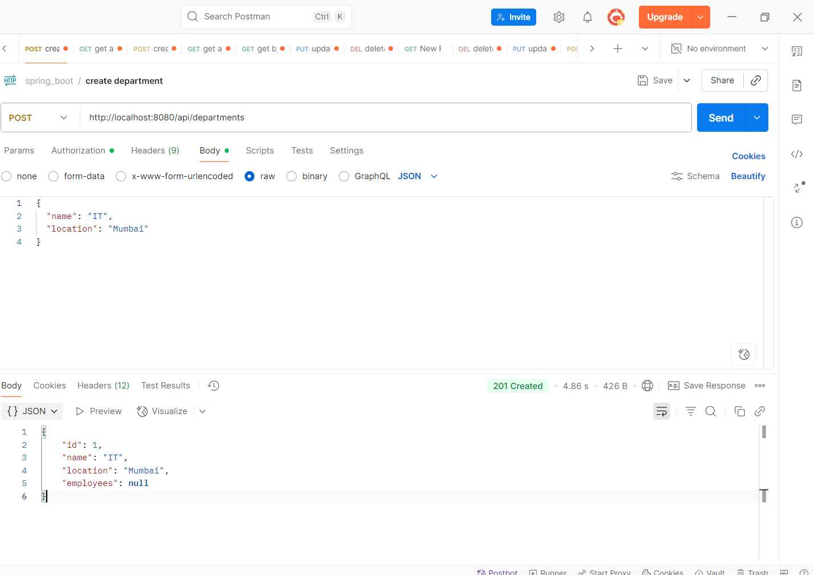

# Employee Management System

## Overview

The **Employee Management System** is a Spring Boot-based RESTful web application designed to manage departments, employees, and users securely. It provides CRUD operations for both departments and employees, with user authentication and role-based access control implemented using **JWT (JSON Web Token)**. The project follows **best practices**, including DTO mapping, global exception handling, and secure password management using **BCrypt**.

## Features

## 🛠 Database Migration (Flyway)

This project uses **Flyway** for database version control.  
The migration scripts are stored in the `src/main/resources/db/migration` folder.

- **V1__create_departments_table.sql** → Creates the `departments` table
- **V2__create_employees_table.sql** → Creates the `employees` table

Flyway automatically runs these migrations on application startup, ensuring the database schema is always in sync with the project.


* **Department Management**

    * Add, update, delete, and view departments.
    * Each department can have multiple employees associated.

* **Employee Management**

    * Add, update, delete, and view employee records.
    * Assign employees to departments.

* **User Authentication**

    * Secure login using JWT.
    * Role-based access (`ROLE_ADMIN`, `ROLE_USER`).

* **Global Exception Handling**

    * Consistent API error responses.
    * Validation and custom exceptions handled gracefully.

* **Swagger/OpenAPI Documentation**

    * All APIs are documented with Swagger for easy testing.

## Tech Stack

* **Backend:** Java 17, Spring Boot, Spring Security, JWT
* **Database:** MySQL
* **Build Tool:** Maven
* **Other Libraries:** Lombok, Jakarta Persistence (JPA), Swagger (OpenAPI 3)
* **IDE:** IntelliJ IDEA / Eclipse

## Project Structure

```
EmployeeManagementSystem/
├── logs/ # Log files
├── src/
│ ├── images/ # Postman test screenshots
│ ├── main/
│ │ ├── java/com/example/EmployeeManagementSystem/
│ │ │ ├── config/ # Security & Config classes
│ │ │ ├── controller/ # REST Controllers
│ │ │ ├── dto/ # Request/Response DTOs
│ │ │ ├── entity/ # JPA Entities
│ │ │ ├── exceptions/ # Custom Exceptions
│ │ │ ├── mapper/ # DTO <-> Entity Mappers
│ │ │ ├── repository/ # Spring Data JPA Repositories
│ │ │ ├── security/ # JWT Security
│ │ │ └── service/ # Business Logic
│ │ └── resources/
│ │ ├── db/migration/ # Flyway SQL migration scripts
│ │ │ ├── V1__create_departments_table.sql
│ │ │ └── V2__create_employees_table.sql
│ │ ├── application.properties
│ │ ├── logback-spring.xml
│ │ └── templates/ # (If using Thymeleaf)
│ └── test/ # Test classes
├── target/ # Compiled output
├── README.md
├── .gitignore
└── pom.xml
```

## Entities

### Department

```java
@Data
@Entity
public class Department {
    @Id
    @GeneratedValue
    private Long id;
    private String name;
    private String location;
}
```

### Employee

```java
@Data
@Entity
public class Employee {
    @Id
    @GeneratedValue
    private Long id;
    private String firstName;
    private String lastName;
    private String email;
    private String phoneNumber;
    private Double salary;

    @ManyToOne
    private Department department;
}
```

### AppUser (Security)

```java
@Data
@Entity
@Table(name = "users")
public class AppUser {
    @Id
    @GeneratedValue
    private Long id;

    @Column(unique = true, nullable = false)
    private String username;

    @Column(nullable = false)
    private String password; // hidden from Swagger for security

    private String role; // ROLE_ADMIN or ROLE_USER
}
```

## DTOs

### DepartmentRequest

```java
@Data
public class DepartmentRequest {
    private String name;
    private String location;
}
```

### DepartmentResponse

```java
@Data
public class DepartmentResponse {
    private Long id;
    private String name;
    private String location;
    private List<EmployeeResponse> employees; // optional
}
```

### EmployeeRequest & EmployeeResponse

```java
@Data
public class EmployeeRequest {
    private String firstName;
    private String lastName;
    private String email;
    private String phoneNumber;
    private Double salary;
    private Long departmentId;
}

@Data
public class EmployeeResponse {
    private Long id;
    private String firstName;
    private String lastName;
    private String email;
    private String phoneNumber;
    private Double salary;
    private DepartmentResponse department;
}
```

## Security & JWT

* JWT is used for user authentication.
* **Login endpoint:** `/api/auth/login`
* **Role-based authorization:**

    * `ROLE_ADMIN` – Full access to all APIs
    * `ROLE_USER` – Read-only access
* Passwords are **encrypted using BCrypt**.

## Exception Handling

* Custom exceptions: `ResourceNotFoundException`, `BadRequestException`, `ApiException`
* Global exception handler returns structured error responses:

```json
{
  "timestamp": "2025-09-10T14:32:11.123",
  "status": 404,
  "error": "Not Found",
  "message": "Employee not found",
  "path": "/api/employees/99"
}
```

## Swagger Documentation

* URL: `http://localhost:8080/swagger-ui/index.html`
* All endpoints are documented with:

    * Request parameters
    * Response models
    * Example values
* Sensitive fields like `password` are hidden in Swagger UI.

## Setup & Installation

1. **Clone the repository**

```bash
git clone https://github.com/<your-username>/EmployeeManagementSystem.git
cd EmployeeManagementSystem
```

2. **Configure MySQL**

* Create a database, e.g., `ems_db`.
* Update `application.properties` with your DB credentials:

```properties
spring.datasource.url=jdbc:mysql://localhost:3306/ems_db
spring.datasource.username=root
spring.datasource.password=root
spring.jpa.hibernate.ddl-auto=update
```

3. **Build & Run**

```bash
mvn clean install
mvn spring-boot:run
```

4. **Access Swagger**

* Open browser: `http://localhost:8080/swagger-ui/index.html`

## API Endpoints (Sample)

| Module         | Endpoint           | Method | Role       |
| -------------- | ------------------ | ------ | ---------- |
| Department     | `/api/departments` | GET    | ADMIN/USER |
| Department     | `/api/departments` | POST   | ADMIN      |
| Employee       | `/api/employees`   | GET    | ADMIN/USER |
| Employee       | `/api/employees`   | POST   | ADMIN      |
| Authentication | `/api/auth/login`  | POST   | PUBLIC     |

## Screenshots

## 📸 API Testing Screenshots

Below are the Postman test results for all CRUD operations and security features.

### 🟢 Authentication


### 🟢 Authorization


### 🟢 Create Department


### 🟢 Create Employee


### 🟢 Delete Employee


### 🟢 Delete Department


### 🟢 Update Employee


### 🟢 Update Department


### 🟢 Get all employees with  pagination and filtering


### 🟢 Get all departments


## Contribution

* Fork the repository
* Create a feature branch (`git checkout -b feature/your-feature`)
* Commit your changes (`git commit -m 'Add feature'`)
* Push to branch (`git push origin feature/your-feature`)
* Create a Pull Request

## License

This project is licensed under the MIT License.
